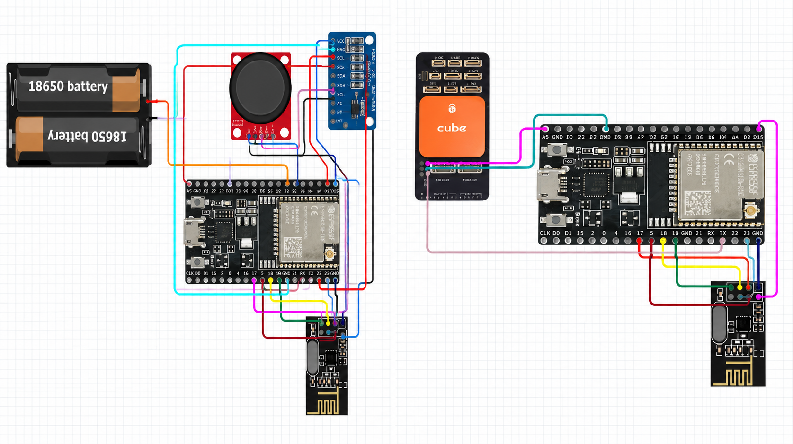
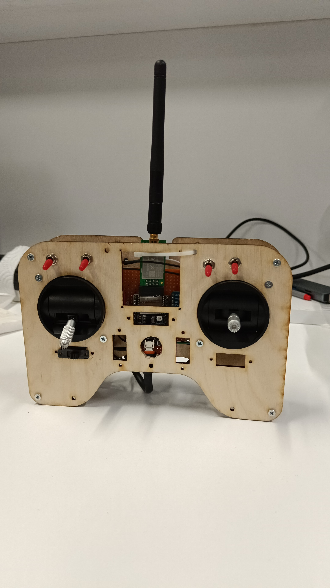
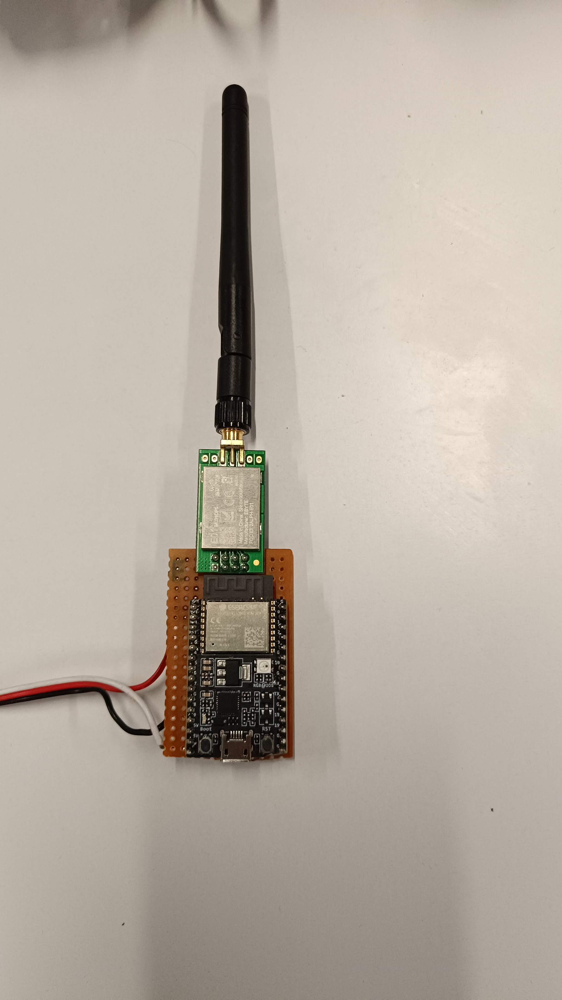

# SBUS UAV Control System

## Overview

This project presents a wireless control system developed using ESP32 microcontrollers and NRF24L01 transceivers. The system generates an SBUS-compatible signal for communication with a Pixhawk flight controller in UAV applications.

## Technologies

- ESP32
- NRF24L01
- SBUS Protocol
- Pixhawk
- Arduino IDE

## System Architecture

  

The figure illustrates the overall transmitter and receiver architecture of the communication system.

## Hardware

### Remote Controller

  

### Receiver

  

## My Contributions

- Designed the wireless communication architecture
- Configured SBUS communication
- Integrated ESP32 and NRF24L01 modules
- Tested communication stability with the flight controller

## Source Code

The source code is not publicly available because it was developed as part of a team project.

## Author

Muhammet Akın Aslan
